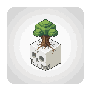

<div align="center">
    <h1>Bones³</h1>
    
    <p><em><strong>Bones³</strong> (Bones Cubed) is a 3D voxel framework for Bevy, allowing for the creation of dynamic, interactive, grid-aligned maps, including the rendering and handling of both cubic and non-cubic block models, tiles, and actors.</em></p>
</div>
<br clear="right" />

---

## Installation
Bones³ is still in early alpha and *not* currently available on [Crates.io](https://crates.io). However, it framework can still be installed via git for experimentation by adding the following to your `Cargo.toml` file.

```toml
[dependencies]
bones-cubed = { git = "https://github.com/TheDudeFromCI/bones-cubed.git" }
```

### Version Support
| Bevy   | Bones³ |
| ------ | ------ |
| 1.18.x | 0.1    |